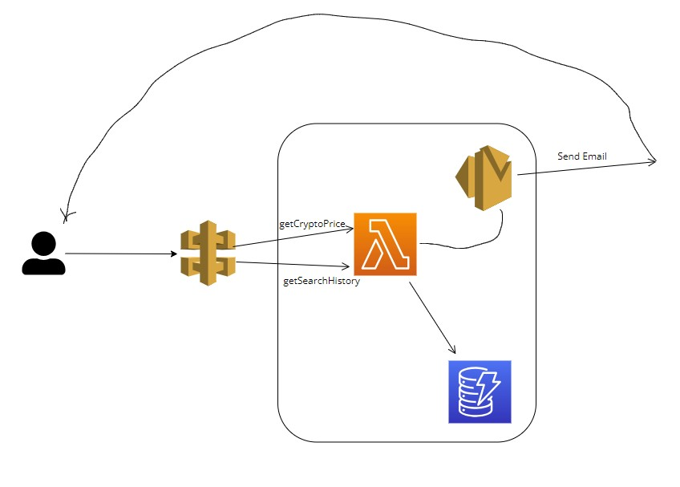
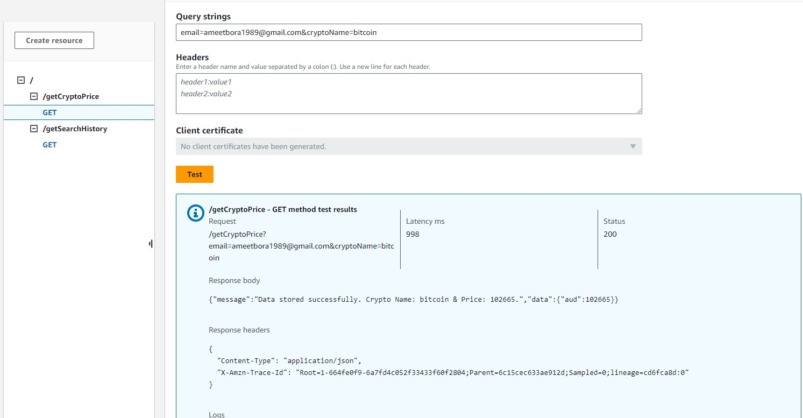
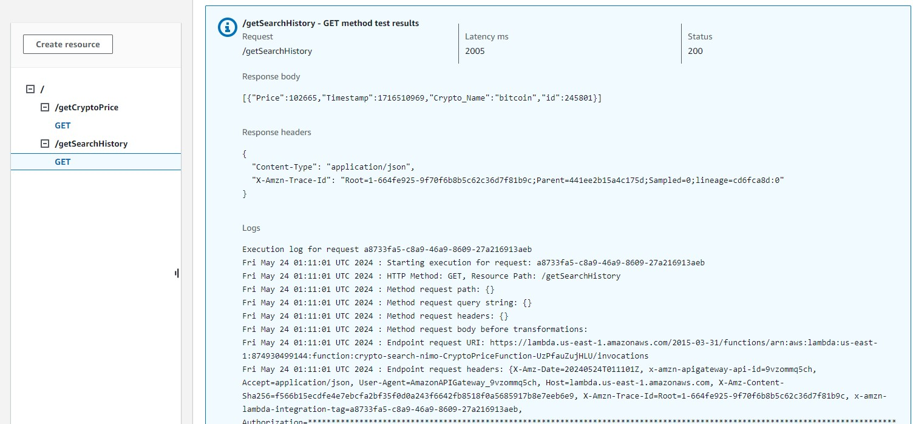

# nimochallenge
=======
# crypto-price-search

This project contains source code and supporting files for a serverless application that you can deploy with the AWS Serverless Application Model (AWS SAM) command line interface (CLI). It includes the following files and folders:

- `crypto_search` - Code for the application's Lambda function.
- `template.yaml` - A template that defines the application's AWS resources.

The application uses several AWS resources, including Lambda functions, an API Gateway API, and Amazon DynamoDB tables. These resources are defined in the `template.yaml` file in this project. You can update the template to add AWS resources through the same deployment process that updates your application code.


## Deploy the sample application

The AWS SAM CLI is an extension of the AWS CLI that adds functionality for building and testing Lambda applications. It uses Docker to run your functions in an Amazon Linux environment that matches Lambda. It can also emulate your application's build environment and API.

To use the AWS SAM CLI, you need the following tools:

* AWS SAM CLI - [Install the AWS SAM CLI](https://docs.aws.amazon.com/serverless-application-model/latest/developerguide/serverless-sam-cli-install.html).
* Node.js - [Install Node.js 20](https://nodejs.org/en/), including the npm package management tool.
* Docker - [Install Docker community edition](https://hub.docker.com/search/?type=edition&offering=community).

Prerequisites to run the API. 

1. Create a SES email gateway with sender email validated. 
2. Create an account in Coingecko and get the API keys
3. Once the repo is cloned, follow the below instructions.

```bash
cd crypto-search
npm i dotenv
touch .env
```

Add the following values in the .env file

```bash
COINGECKO_API_KEY=''
DEFAULT_EMAIL=''
DEFAULT_COIN=''
```

To build and deploy your application for the first time, run the following in your shell:

```bash
sam build
sam deploy --guided --capabilities CAPABILITY_NAMED_IAM
```

Crypto Search Architecture



How to run the API

Go to AWS Console and select the API Gateway 

Locate the API endpoints newly created.

Copy the API endpoints and test the APIs using Browser or Postman

API 1: /getCryptoPrice

User Parameters: email address and crypto name

```bash
  /getCryptoPrice?email=<email>&cryptoName=<cryptoName>
````

Please make sure the names of the crypto currencies are selected from Coingecko documentation and format.



API 2: /getSearchHistory

Description: This API will give a list of all the crypto price searched by API1.


```bash
  /getSearchHistory
````


 

# End of Document

